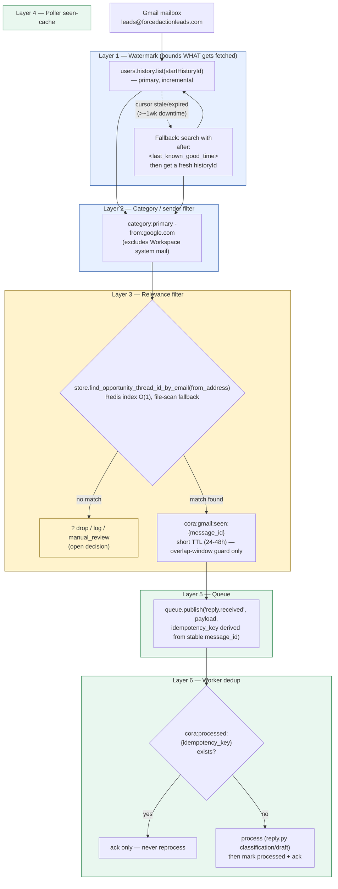

# Cora Reply-Mailbox Ingestion — Reliability Design

Covers how `src/agents/cora/ingestion/reply_mailbox_poller.py` fetches, filters, and
hands off real prospect replies from a Google Workspace mailbox, and the layers
that make that safe and cheap at scale (bounded cost, no duplicate processing,
no permanently-missed replies).

**Status note**: this document describes the *target* design, agreed across a
design discussion. Not every layer below is built yet — each one is marked
✅ **Implemented** or 🔲 **Proposed, not yet built**. See "Current vs proposed"
at the bottom for the exact gap list.

---

## Diagram

---

## Layer 1 — Watermark (bounds *what* gets fetched from Gmail)

**Problem it solves**: Cora only has `gmail.readonly` — it can never mark a
message read. Without a bound, every poll would re-list the *entire*
accumulated unread pile, real replies and unrelated junk alike, forever
growing. Cost would scale with total historical volume, not with new-mail
rate.

**Mechanism**: Gmail's incremental change-log API, `users.history.list` +
a saved `startHistoryId` cursor — hand it "where I left off," get back only
what changed since then. Primary path.

**Fallback**: Gmail retains history for roughly a week. If the poller is
down longer than that, the saved cursor goes stale (`history.list` errors).
Recovery: catch that specific error, fall back to a bounded search
(`after:{last_known_good_timestamp}`) to catch up on the gap, then fetch a
fresh `historyId` via `users.getProfile()` and resume normal incremental
polling from there. Two watermarks working together — `startHistoryId` as
the fast path, a timestamp as the backup for recovery only.

**Named pattern**: Change Data Capture / incremental sync, cursor-based
checkpointing with resync-on-gap (the same shape CDC tools like Debezium use
when a replication-log position expires and a bootstrap snapshot is needed).

## Layer 2 — Category / sender filter

**Problem it solves**: caught live, in production — the first real poll
pulled 11 messages from `notify-noreply@google.com` /
`workspace-noreply@google.com` (Workspace's own system notifications) and
published them as if they were prospect replies.

**Mechanism**: `category:primary -from:google.com` added to the Gmail
search query. `category:primary` excludes Gmail's own Updates/Promotions/
Social/Forums tabs, where system mail normally lands; `-from:google.com` is
a direct, confirmed-necessary backstop against Workspace's own senders.

## Layer 3 — Relevance filter (is this actually a reply to something Cora sent?)

**Problem it solves**: not every unread, non-system message in that inbox is
a reply to Cora's own outreach — this decides whether a message deserves to
become a `reply.received` event at all.

**Mechanism**: `store.find_opportunity_thread_id_by_email(from_address)` —
checks a Redis index (`cora:email_thread_index:{email}` → `opportunity_thread_id`,
written at draft-creation time in `outreach.py`, no TTL) first, O(1); falls
back to a full scan of the drafts JSON-Lines file only on a miss (covers
drafts created before the index existed, or a cold Redis start). A match
means a resolved `opportunity_thread_id` gets passed straight into the
published event, so `reply.py`'s own matching step doesn't repeat the same
lookup.

**Open decision — what happens on no match**: silently drop (cleanest, but
a prospect replying from an unexpected address vanishes with zero trace);
log it without queuing (structured log line, discoverable via search/
alerting, but never touches the queue or the reply store); or still publish,
tagged for `manual_review` (today's behavior, downstream in `reply.py`, just
moved earlier). **Not yet decided.**

## Layer 4 — Poller's own "seen" cache

**Problem it solves**: guards against the *deliberate* overlap window Layer
1's fallback re-examines (to cover Gmail's search-index lag), and any
intra-poll double-processing. Its job shrank once Layer 1 started bounding
the query itself — it is **not** the last line of defense against
reprocessing old mail anymore (that's Layer 1's job).

**Mechanism**: `cora:gmail:seen:{message_id}` in Redis, with a **modest TTL
(24-48h)** — long enough to safely cover the overlap window, short enough
that memory stays flat regardless of total volume or how many years this
runs. (A fully permanent, no-TTL version of this was the *original* fix for
the idempotency bug the current 30-day-TTL version has — but permanent-forever
is the wrong shape once Layer 1 exists; bounded-but-long-enough is correct.)

## Layer 5 — Queue

**Mechanism**: `queue.publish("reply.received", payload, idempotency_key=...)`.
The idempotency key must be derived from the **stable Gmail `message_id`**,
not from a processing-time timestamp (today's actual bug: the current key is
built from `from_address:received_at`, and `received_at` is re-stamped at
processing time — so the same message reprocessed later gets a *different*
key, defeating dedup at every downstream layer).

## Layer 6 — Worker's own dedup

**Mechanism**: `cora:processed:{idempotency_key}` in Redis — checked before
attempting work, set only *after* successfully finishing (never before
attempting — marking on attempt would permanently block retries of a
message that failed once; this was a real bug caught and fixed earlier this
build). TTL currently 24h.

**What it actually guarantees**: catches a duplicate *within* its own TTL
window — comfortably covers the short overlap-window scenario Layer 4 also
guards, since that's measured in minutes, not days. It is **not** an
unconditional guarantee against arbitrarily long delays; that's Layer 1's
responsibility, upstream of this ever being reached.

**Named pattern**: Idempotent Consumer / Idempotent Receiver (Hohpe,
*Enterprise Integration Patterns*) — the standard way to get *effectively-once*
processing on top of an at-least-once delivery guarantee (which Redis
Streams, like Kafka and SQS, provides by default). True exactly-once
delivery across independent systems doesn't really exist; this is the
realistic, standard substitute.

---

## Current vs proposed

| Layer | Status | Detail |
|---|---|---|
| 1 — Watermark / History API | 🔲 Proposed, not yet built | Current code still does an unbounded `is:unread` search every poll — no cursor, no fallback |
| 2 — Category / sender filter | ✅ Implemented | `_UNREAD_REPLY_QUERY = "is:unread category:primary -from:google.com"` |
| 3 — Relevance filter before queue | 🔲 Proposed, not yet built | Currently everything matching Layer 2's query gets published; email-matching only happens downstream in `reply.py`, not in the poller |
| 4 — Poller seen-cache | 🟡 Implemented, wrong TTL | Exists (`_already_seen`/`_mark_seen`), but currently 30 days — needs to shrink to 24-48h once Layer 1 exists |
| 5 — Queue idempotency key | 🟡 Implemented, wrong basis | Exists, but keyed on `from_address:received_at` (unstable) instead of the Gmail `message_id` (stable) |
| 6 — Worker dedup | ✅ Implemented | Mark-on-success (not mark-on-attempt) fixed earlier this build; 24h TTL |

Net: 2 of 6 layers are fully correct today (2 and 6); 2 exist but need a
change (4's TTL, 5's key basis — both small, mechanical fixes); 2 don't
exist yet (1 and 3 — the two that actually require new code, not just a
constant change).
